# Suhba Database ER Diagram

## Entity Relationship Diagram for Suhba Islamic Educational Game Platform

```mermaid
erDiagram
    %% Core User and Authentication
    USERS {
        int user_id PK
        string username
        string email
        string password_hash
        string preferred_language
        string theme_preference
        datetime created_at
        datetime last_login
        boolean is_active
    }

    %% Game Management
    GAMES {
        int game_id PK
        string name
        string game_type
        string description
        json game_config
        boolean is_active
        datetime created_at
    }

    CATEGORIES {
        int category_id PK
        string name
        string description
        int parent_id FK
        string knowledge_domain
    }

    %% Question and Content System
    QUESTIONS {
        int question_id PK
        int game_id FK
        int category_id FK
        text prompt
        string question_type
        string difficulty
        text explanation
        json metadata
        string character_role
        datetime created_at
    }

    ANSWER_OPTIONS {
        int option_id PK
        int question_id FK
        text option_text
        boolean is_correct
        int option_order
        text explanation
    }

    %% Islamic Content Entities
    ISLAMIC_FIGURES {
        int figure_id PK
        string name
        string arabic_name
        string category
        text biography
        text significance
        string birth_year
        string death_year
        string era
    }

    SURAHS {
        int surah_id PK
        string name
        string arabic_name
        int surah_number
        int revelation_order
        int verses_count
        string revelation_type
    }

    VERSES {
        int verse_id PK
        int surah_id FK
        int verse_number
        text arabic_text
        text translation
        text transliteration
        json tafsir_references
    }

    HADITH_COLLECTIONS {
        int collection_id PK
        string name
        string arabic_name
        string compiler
        text description
        string authenticity_level
    }

    HADITHS {
        int hadith_id PK
        int collection_id FK
        text hadith_text
        text arabic_text
        string grade
        string chapter
        string hadith_number
        text context
    }

    NARRATORS {
        int narrator_id PK
        string name
        string arabic_name
        string role
        text biography
        string birth_year
        string death_year
        string reliability_grade
    }

    HADITH_CHAINS {
        int chain_id PK
        int hadith_id FK
        int narrator_id FK
        int chain_order
        string role_in_chain
    }

    %% Game Session and Progress
    GAME_SESSIONS {
        int session_id PK
        int user_id FK
        int game_id FK
        int score
        float accuracy
        datetime start_time
        datetime end_time
        string difficulty
        string mode
        json session_data
    }

    USER_RESPONSES {
        int response_id PK
        int session_id FK
        int question_id FK
        int selected_option_id FK
        text response_text
        boolean is_correct
        int time_taken
        datetime timestamp
    }

    %% Achievements and Rewards
    ACHIEVEMENTS {
        int achievement_id PK
        string name
        text description
        string requirement_type
        float requirement_value
        int reward_points
        string badge_icon
        string category
    }

    USER_ACHIEVEMENTS {
        int user_achievement_id PK
        int user_id FK
        int achievement_id FK
        datetime unlocked_at
        json unlock_context
    }

    %% Game Features
    POWERUPS {
        int powerup_id PK
        string name
        string arabic_name
        text description
        string effect_type
        int duration
        string rarity
        string icon
        json effect_config
    }

    IMAN_DEFENDER_WORDS {
        int word_id PK
        string negative_word
        string positive_counter
        string arabic_negative
        string arabic_positive
        string explanation
        string difficulty
    }

    %% Statistics and Analytics
    USER_STATISTICS {
        int stat_id PK
        int user_id FK
        int game_id FK
        int total_questions
        int correct_answers
        int best_score
        int total_play_time
        datetime last_played
        json detailed_stats
    }

    LEADERBOARDS {
        int leaderboard_id PK
        int user_id FK
        int game_id FK
        int score
        string period
        datetime recorded_at
        int rank_position
    }

    %% Multiplayer and Social
    ROOMS {
        int room_id PK
        string room_code
        int host_user_id FK
        string status
        json room_config
        datetime created_at
        datetime expires_at
    }

    ROOM_PARTICIPANTS {
        int participant_id PK
        int room_id FK
        int user_id FK
        datetime joined_at
        boolean is_active
    }

    %% Prayer Times Integration
    PRAYER_TIMES {
        int prayer_time_id PK
        int user_id FK
        string location
        date prayer_date
        time fajr
        time dhuhr
        time asr
        time maghrib
        time isha
        json calculation_method
    }

    %% Relationships
    USERS ||--o{ GAME_SESSIONS : plays
    USERS ||--o{ USER_ACHIEVEMENTS : earns
    USERS ||--o{ USER_STATISTICS : has
    USERS ||--o{ LEADERBOARDS : appears_in
    USERS ||--o{ ROOMS : creates
    USERS ||--o{ ROOM_PARTICIPANTS : joins
    USERS ||--o{ PRAYER_TIMES : has

    GAMES ||--o{ QUESTIONS : contains
    GAMES ||--o{ GAME_SESSIONS : hosts
    GAMES ||--o{ USER_STATISTICS : tracked_in

    CATEGORIES ||--o{ QUESTIONS : categorizes
    CATEGORIES ||--o{ CATEGORIES : "parent-child"

    QUESTIONS ||--o{ ANSWER_OPTIONS : has
    QUESTIONS ||--o{ USER_RESPONSES : receives

    GAME_SESSIONS ||--o{ USER_RESPONSES : records

    ACHIEVEMENTS ||--o{ USER_ACHIEVEMENTS : unlocked_as

    SURAHS ||--o{ VERSES : contains
    HADITH_COLLECTIONS ||--o{ HADITHS : contains
    HADITHS ||--o{ HADITH_CHAINS : has
    NARRATORS ||--o{ HADITH_CHAINS : participates_in

    ROOMS ||--o{ ROOM_PARTICIPANTS : has

    USER_RESPONSES }o--|| ANSWER_OPTIONS : selects
    ROOMS }o--|| USERS : hosted_by
```

## Key Entity Descriptions

### Core Entities

**USERS**: Central entity managing user accounts, preferences, and authentication.

**GAMES**: Different game types (Fiqh Master, Wisdom Seeker, Iman Defender, etc.) with their configurations.

**QUESTIONS**: All question content with associated metadata, difficulty levels, and explanations.

### Islamic Content Entities

**ISLAMIC_FIGURES**: Prophets, Sahabas, scholars, and other important Islamic personalities.

**SURAHS & VERSES**: Complete Quranic content with Arabic text, translations, and Tafsir references.

**HADITHS & NARRATORS**: Hadith collections with complete Isnad chains for authentication.

### Game Mechanics

**GAME_SESSIONS**: Individual gameplay sessions with scoring and timing data.

**ACHIEVEMENTS**: Reward system for user progression and engagement.

**POWERUPS**: Special abilities for action games like Iman Defender.

### Social Features

**ROOMS & PARTICIPANTS**: Multiplayer game session management.

**LEADERBOARDS**: Competitive rankings across different games and time periods.

## Database Design Principles

1. **Normalization**: Proper separation of concerns with minimal redundancy
2. **Scalability**: JSON fields for flexible game-specific data
3. **Islamic Authenticity**: Dedicated tables for Islamic scholarly content
4. **Performance**: Indexed fields for common queries
5. **Extensibility**: Easy addition of new game types and features
6. **Multilingual**: Support for Arabic and English content
7. **Analytics**: Comprehensive tracking for learning progress

## Implementation Notes

- Use appropriate indexes on foreign keys and frequently queried fields
- Implement proper constraints for data integrity
- Consider partitioning for large tables like USER_RESPONSES
- Use database triggers for automatic timestamp updates
- Implement soft deletes for user data retention policies